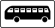
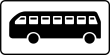

# osm_jp_access

-------

# 提案

Draft: OpenStreetMap Japan Key:access - Land-based transportation  
日本の「車両別アクセスタグ」の提案

[Japan tagging](https://wiki.openstreetmap.org/wiki/Japan_tagging) - [access](https://wiki.openstreetmap.org/wiki/JA:Key:access) - [Land-based transportation / 陸上交通](https://wiki.openstreetmap.org/wiki/JA:Key:access#.E9.99.B8.E4.B8.8A.E4.BA.A4.E9.80.9A)

```
1. access=*
┃
┣━ 2. foot=*   歩行者
┃
┗━ 3. vehicle=*    車両
　　　┃
　　　┣━ 4. bicycle=*     自転車
　　　┃
　　　┣━ 5. carriage=*    軽車両
　　　┃
　　　┗━ 6. motor_vehicle 動力付き車両
　　　　　　┃
　　　　　　┣━ 7. tram 路面電車
　　　　　　┃
　　　　　　┣━ 8. trollerbus 「トロリー」 トロリーバス
　　　　　　┃
　　　　　　┗━ 9. motor_car 自動車
　　　　　　　　　┃
　　　　　　　　　┣━ 10. hgv_caravan 「けん引」 重被牽引車をけん引しているけん引自動車
　　　　　　　　　┃
　　　　　　　　　┣━ 11. disabled 「標章車」 高齢運転者等、標章自動車
　　　　　　　　　┃
　　　　　　　　　┣━ 12. agricultural 「小特」 小型特殊自動車
　　　　　　　　　┃
　　　　　　　　　┣━ 13. route_bus   「路線バス」　路線定期運行の用に供する自動車
　　　　　　　　　┃
　　　　　　　　　┣━ 14. taxi=*      「タクシー」　一般乗用旅客自動車運送事業の用に供する自動車
　　　　　　　　　┃
　　　　　　　　　┣━ 15. motorcycle「二輪」 二輪の自動車及び原動機付自転車
　　　　　　　　　┃　　┃
　　　　　　　　　┃　　┣━ 16. (motorbike)　「自二輪」　大型自動二輪車、普通自動二輪車
　　　　　　　　　┃　　┃
　　　　　　　　　┃　　┗━ 17. moped　「小二輪」　小型二輪車、原動機付自転車
　　　　　　　　　┃　　　　　┃
　　　　　　　　　┃　　　　　┗━ 18. mofa　「原付」　原動機付自転車
　　　　　　　　　┃
　　　　　　　　　┣━ 19. hgv=*,goods=*  「貨物」　
　　　　　　　　　┃　　┃
　　　　　　　　　┃　　┣━ 20. hgv:l     「大貨」　
　　　　　　　　　┃　　┃
　　　　　　　　　┃　　┣━ 21. goods:m   「中貨」　
　　　　　　　　　┃　　┃
　　　　　　　　　┃　　┣━ 22. goods:ms  「準中貨」　
　　　　　　　　　┃　　┃
　　　　　　　　　┃　　┗━ 23. goods:normal 「普貨」　
　　　　　　　　　┃
　　　　　　　　　┣━ 24. motor_car:l=*,motor_car:xm=*,motor_car:xl=*　「大型等」
　　　　　　　　　┃　　┃
　　　　　　　　　┃　　┣━ 25. motor_car:l 「大型」 大型自動車
　　　　　　　　　┃　　┃　　┃
　　　　　　　　　┃　　┃　　┣━ 20. hgv:l  「大貨」　
　　　　　　　　　┃　　┃　　┃
　　　　　　　　　┃　　┃　　┗━ 26. psv:l 「大乗」 大型乗用自動車
　　　　　　　　　┃　　┃　　　　　┃
　　　　　　　　　┃　　┃　　　　　┣━ 27. tourist_bus 「観光バス」
　　　　　　　　　┃　　┃　　　　　┃
　　　　　　　　　┃　　┃　　　　　┣━ 28. bus:l 「大型バス」
　　　　　　　　　┃　　┃　　　　　┃
　　　　　　　　　┃　　┃　　　　　┗━ 29. minibus 「マイクロ」
　　　　　　　　　┃　　┃　　　　　　　　┃
　　　　　　　　　┃　　┃　　　　　　　　┗━ 34.psv:xm 「特定中乗」 特定中型乗用自動車
　　　　　　　　　┃　　┃
　　　　　　　　　┃　　┣━ 30. motor_car:m 「中型」 中型自動車
　　　　　　　　　┃　　┃　　┃
　　　　　　　　　┃　　┃　　┣━ 21. goods:m  「中貨」　
　　　　　　　　　┃　　┃　　┃
　　　　　　　　　┃　　┃　　┗━ 31. psv:m 「中乗」 中型乗用自動車
　　　　　　　　　┃　　┃
　　　　　　　　　┃　　┣━ 32.motor_car:xm 「特定中型」 特定中型自動車
　　　　　　　　　┃　　┃　　┃
　　　　　　　　　┃　　┃　　┣━ 33.hgv:xm  「特定中貨」　特定中型貨物
　　　　　　　　　┃　　┃　　┃
　　　　　　　　　┃　　┃　　┗━ 34.psv:xm 「特定中乗」 特定中型乗用自動車
　　　　　　　　　┃　　┃
　　　　　　　　　┃　　┣━ 35.hgv 「大貨等」[トラックマーク] 　
　　　　　　　　　┃　　┃　　┃
　　　　　　　　　┃　　┃　　┣━ 20.hgv:l  「大貨」　
　　　　　　　　　┃　　┃　　┃
　　　　　　　　　┃　　┃　　┣━ 34.mortor_car:xl　「大特」 大型特殊自動車
　　　　　　　　　┃　　┃　　┃
　　　　　　　　　┃　　┃　　┗━ 33.hgv:xm 「特定中貨」
　　　　　　　　　┃　　┃
　　　　　　　　　┃　　┣━ 22.goods:ms  「準中貨」　
　　　　　　　　　┃　　┃
　　　　　　　　　┃　　┗━ 23.goods:normal 「普貨」　
　　　　　　　　　┃
　　　　　　　　　┣━ 25.motor_car:l 「大型」 大型自動車
　　　　　　　　　┃　　┃
　　　　　　　　　┃　　┣━ 20.hgv:l  「大貨」　
　　　　　　　　　┃　　┃
　　　　　　　　　┃　　┗━ 26.psv:l 「大乗」 大型乗用自動車
　　　　　　　　　┃　　　　　┃
　　　　　　　　　┃　　　　　┣━ 27.tourist_bus 「観光バス」
　　　　　　　　　┃　　　　　┃
　　　　　　　　　┃　　　　　┣━ 28.bus:l 「大型バス」
　　　　　　　　　┃　　　　　┃
　　　　　　　　　┃　　　　　┗━ 29.minibus 「マイクロ」
　　　　　　　　　┃　　　　　　　　┃
　　　　　　　　　┃　　　　　　　　┗━ 34.psv:xm 「特定中乗」 特定中型乗用自動車
　　　　　　　　　┃
　　　　　　　　　┣━ 30.motor_car:m 「中型」 中型自動車
　　　　　　　　　┃　　┃
　　　　　　　　　┃　　┣━ 21.goods:m  「中貨」　
　　　　　　　　　┃　　┃
　　　　　　　　　┃　　┗━ 31.psv:m 「中乗」 中型乗用自動車
　　　　　　　　　┃
　　　　　　　　　┣━ 32.motor_car:xm 「特定中型」 特定中型自動車
　　　　　　　　　┃　　┃
　　　　　　　　　┃　　┣━ 33.hgv:xm  「特定中貨」　
　　　　　　　　　┃　　┃
　　　　　　　　　┃　　┗━ 34.psv:xm 「特定中乗」 特定中型乗用自動車
　　　　　　　　　┃
　　　　　　　　　┣━ 36.motor_car:ms 「準中型」 準中型自動車
　　　　　　　　　┃　　┃
　　　　　　　　　┃　　┣━ 22.goods:ms 「準中貨」　
　　　　　　　　　┃　　┃
　　　　　　　　　┃　　┗━ 37.psv:ms 「準中乗」 準中型乗用自動車
　　　　　　　　　┃
　　　　　　　　　┣━ 38.motor_car:normal 「普通」 普通自動車
　　　　　　　　　┃　　┃
　　　　　　　　　┃　　┣━ 23.goods:normal 「普貨」　
　　　　　　　　　┃　　┃
　　　　　　　　　┃　　┣━ 39.motor_car:kei 「軽」 軽自動車
　　　　　　　　　┃　　┃
　　　　　　　　　┃　　┗━ 40.psv:ms 「普乗」 普通乗用自動車
　　　　　　　　　┃
　　　　　　　　　┗━ 41. psv 「乗用」 専ら人を運搬する構造の自動車
　　　　　　　　　　　　┃
　　　　　　　　　　　　┣━ 31.psv:m 「中乗」 中型乗用自動車
　　　　　　　　　　　　┃
　　　　　　　　　　　　┣━ 42.bus 「バス」[バスマーク] 
　　　　　　　　　　　　┃　　┃
　　　　　　　　　　　　┃　　┗━ 26.psv:l 「大乗」 大型乗用自動車
　　　　　　　　　　　　┃　　　　　┃
　　　　　　　　　　　　┃　　　　　┣━ 27.tourist_bus 「観光バス」
　　　　　　　　　　　　┃　　　　　┃
　　　　　　　　　　　　┃　　　　　┣━ 28.bus:l 「大型バス」
　　　　　　　　　　　　┃　　　　　┃
　　　　　　　　　　　　┃　　　　　┗━ 29.minibus 「マイクロ」
　　　　　　　　　　　　┃　　　　　　　　┃
　　　　　　　　　　　　┃　　　　　　　　┗━ 34.psv:xm 「特定中乗」 特定中型乗用自動車
　　　　　　　　　　　　┃
　　　　　　　　　　　　┣━ 37.psv:ms 「準中乗」 準中型乗用自動車
　　　　　　　　　　　　┃
　　　　　　　　　　　　┗━ 40.psv:normal 「普乗」 普通乗用自動車
```


## 参考

 * 日本の道路標識に示される車両種別は [道路標識、区画線及び道路標示に関する命令 （六）車両の種類の略称](http://elaws.e-gov.go.jp/search/elawsSearch/elaws_search/lsg0500/detail?lawId=335M50004002003&openerCode=1) に規定されている。
 以下引用
 	
 | 略称        | 車両の種類          |
|:-------------:|:--------------- | 
| 大型 | 大型自動車 |
| 大型等 | 大型自動車、特定中型自動車及び大型特殊自動車 |
| 中型 | 中型自動車 |
| 特定中型 | 特定中型自動車 |
| 準中型 | 準中型自動車 |
| 普通 | 普通自動車 |
| 大特 | 大型特殊自動車 |
| 自二輪 | 大型自動二輪車及び普通自動二輪車（道路交通法施行規則第二条の表備考の規定により二輪の自動車とみなされ、かつ、同表の大型自動二輪車又は普通自動二輪車に区分される三輪の自動車を含む。） |
| 軽 | 長さが三・四〇メートル以下、幅が一・四八メートル以下、高さが二・〇〇メートル以下の普通自動車（内燃機関を原動機とする自動車にあつては、総排気量が〇・六六〇リットル以下のものに限る。） |
| 小特 | 小型特殊自動車 |
| 原付 | 原動機付自転車 |
| 二輪 | 二輪の自動車及び原動機付自転車 |
| 小二輪 | 道路交通法施行規則第二十四条第一項に規定する小型二輪車及び原動機付自転車 |
| 自転車 | 普通自転車 |
| トロリー | トロリーバス |
| 乗用 | 専ら人を運搬する構造の自動車 |
| 大乗 | 大型乗用自動車 |
| 中乗 | 中型乗用自動車 |
| 特定中乗 | 特定中型乗用自動車 |
| 準中乗 | 準中型乗用自動車 |
| バス |  大型乗用自動車及び特定中型乗用自動車 |
| 大型バス | 乗車定員が三〇人以上の大型乗用自動車 |
| マイクロ | 大型バス以外の大型乗用自動車及び特定中型乗用自動車 |
| 路線バス | 道路運送法（昭和二十六年法律第百八十三号）第九条第一項に規定する一般乗合旅客自動車運送事業者による同法第五条第一項第三号に規定する路線定期運行の用に供する自動車 |
| 普乗 | 普通乗用自動車 |
| タクシー | 道路運送法第三条第一号ハに規定する一般乗用旅客自動車運送事業の用に供する自動車 |
| 貨物 | 大型乗用自動車以外の大型自動車、中型乗用自動車以外の中型自動車、準中型乗用自動車以外の準中型自動車及び普通乗用自動車以外の普通自動車 |
| 大貨 | 大型乗用自動車以外の大型自動車 |
| 大貨等 |  大型乗用自動車以外の大型自動車、特定中型乗用自動車以外の特定中型自動車及び大型特殊自動車 |
| 中貨 | 中型乗用自動車以外の中型自動車 |
| 特定中貨 | 特定中型乗用自動車以外の特定中型自動車 |
| 準中貨 | 準中型乗用自動車以外の準中型自動車 |
| 普貨 | 普通乗用自動車以外の普通自動車 |
| けん引 | 重被牽 引車を牽 引している牽 引自動車 |
| 標章車 | 高齢運転者等標章自動車 |

 | マーク        | 車両の種類          |
|:-------------:|:--------------- | 
|  | 「大貨等」 大型貨物自動車と特定中型貨物自動車、大型特殊自動車 |
|  | 「バス」 大型乗用自動車と特定中型乗用自動車 |


## 継承関係

 * [車両種別の継承関係(クラス図)](http://surveyor.mydns.jp/gitbucket/yuu/osm_jp_access/raw/master/OSMaccess.class.violet.html)  

  
上記は、[車両の種類の略称](http://elaws.e-gov.go.jp/search/elawsSearch/elaws_search/lsg0500/detail?lawId=335M50004002003&openerCode=1)の記載をもとに属性の継承関係を表したもの

### 継承関係の注意点

 よく誤解されると思われる項目

* 「路線バス」は「バス」を継承していません。つまり、「路線バス」は「バス」ではありません。（「大型」でもない）  
このことにより、「バス」進入禁止どうろでも「路線バス」はその規制を受けません。

* 同様に「タクシー」は「中乗」「普乗」を継承していません。

* 「二輪」と「自二輪」は同一ではありません。タグ的に区別する必要が有ります。

* 「小二輪」は「原付」も含みます。

* 


### マトリックス表

継承関係をマトリックスで表現したもの

 * [matrix.ods](matrix.ods) [PDF](matrix.pdf)  
 

## World Wide でのタグ構成

 * [OpenStreetMap Wiki - JA:Key:access](https://wiki.openstreetmap.org/wiki/JA:Key:access) の[6.1 陸上交通](https://wiki.openstreetmap.org/wiki/JA:Key:access#.E9.99.B8.E4.B8.8A.E4.BA.A4.E9.80.9A) / Land-based transportation - access
 
```
access=* （カテゴリ: すべての陸上交通）
┣━ 車両を使わない移動
┃　　┣━ foot=* （歩行者）
┃　　┣━ ski=*
┃　　┣━ inline_skates=*
┃　　┣━ ice_skates=*
┃　　┗━ horse=* （乗馬）
┗━ vehicle=* （カテゴリ: すべての車両)
　　　┣━ 動力がない車両
　　　┃　　┣━ 二輪車
     ┃　　┃　　┗━ bicycle=* （自転車）
　　　┃　　┗━ 三輪以上
     ┃　　　　　┣━ carriage=* （馬＋馬車）
     ┃　　　　　┗━ trailer=* （トレイラー。他の車両が牽引する必要があり、それにも自身の通行制限があります）
     ┃     　　　　　┗━ caravan=* （[W] キャンピングトレーラー、キャラバンとも呼ばれます）┗
　　　┗━ motor_vehicle=* （カテゴリ: すべての動力付き車両）
    　　　　　　┣━ 二輪車
          　　 ┃　　　┣━ motorcycle=* （オートバイ。二輪の動力付き車両、自動車専用道路を通行可）
          　　 ┃　　　┣━ moped=* （速度制限付きの原動機付き自転車。例: 多くは50ccエンジンで、最高速度約45km/h）
          　　 ┃　　　┗━ mofa=* ("低速モペット"、通常は最大設計速度25km/h)
    　　　　　　┣━ 三輪以上
          　　 ┃　　　┣━motorcar=* 自動車
          　　 ┃　　　┃　　　┗━ motorhome=* （[W] キャンピングカー）
    　　　　　　┃　　　┣━ tourist_bus=* ツアーバス、観光バス（路線バスでないもの）
    　　　　　　┃　　　┣━ goods=* （小型貨物トラック、最大積載量3.5トン未満）
    　　　　　　┃　　　┣━ hgv=* （大型貨物トラック、最大積載量3.5トン以上）
    　　　　　　┃　　　┣━ agricultural=* （農耕用動力付き車両（トラクターなど）、追加の制限事項があります（速度制限25km/hなど））
    　　　　　　┃　　　┣━ atv=* バギー （幅が50インチ（1.27m）以下に制限されています）提案中です。代わりにmaxwidth=1.27を使用したほうがよいかもしれません。
    　　　　　　┃　　　┗━ snowmobile=*
    　　　　　　┗━ 用途別
          　　 　　　　┣━psv=* （乗合自動車）
          　　 　　　　┣━bus=* （乗合自動車として使われる大型バス）
          　　 　　　　┣━minibus=* （乗合自動車として使われる小型バス）
          　　 　　　　┣━share_taxi=* （要求に応じて輸送する小型バス）
　          　　 　　　┣━taxi=* （タクシー）
          　　 　　　　┣━hov=* （相乗り自動車、2人以上が同乗した車両（地域によって異なる））
          　　 　　　　┣━car_sharing=* （カーシェアリングサービス）
          　　 　　　　┣━emergency=* （カテゴリー: 緊急車両。救急車、消防車、パトカーなど）
          　　 　　　　┣━hazmat=* （危険物搭載車両）
          　　 　　　　┗━disabled=* （身体障害者標識や、その他の障害者向けの許可。通行制限から除外するために交通標識に使用されます。ただし、駐車に関するものを除く）
```

### World Wide との相違点

* 日本では「自転車」は「軽車両」に含まれるが、[`bicycle`]と[`carriage`]は別物

* 日本では「けん引」は「牽引している車両（トレーラーヘッド）」を表すが、OSMでは[trailer]は「引っ張られる台車」を示すため「非動力車両」に分類されています。そのため、提案では「`hgv_articulated`」としています。

* 日本の「自動車」と[`motor_vehicle`]との違い： 日本では動力付き車両であっても「自動車」とみなさないもの（トロリーバス、路面電車など）が存在するため、提案では「`motor_car`（自動車）」と独自タグを新設しています。

* 二輪車について、日本の場合は、`motorcycle`,`moped`,`mofa` に階層関係が存在します。

* 「自二輪」に`motorcycle`を割り当てました。「二輪」には独自タグを新設するのを避けるため、`motorcycle`,`moped`,`mofa`を列記することとしましたが、適切なワードを新設したほうが良いのではないでしょうか？

 * その他のタグ列記項目
    - 「二輪」→ `motorcycle`,`moped`,`mofa`
    - 「大型等」→  motor_car:l=*,motor_car:xm=*,motor_car:xl=*
    - 「貨物」→  hgv=*,goods=*

-------

<p xmlns:dct="http://purl.org/dc/terms/">
<a rel="license" href="http://creativecommons.org/publicdomain/mark/1.0/">

</a>
<br />
この作品（<a href="https://www.openstreetmap.org/user/hayashi" rel="dct:creator"><span property="dct:title">hayashi</span></a>)による<span property="dct:title">JapanTagging 車種別アクセス制限タグのドラフト</span>）は著作権法上の制約が知られている限り存在していません。
</p>
